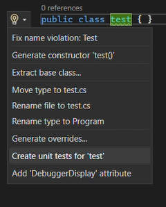

## Highlevel steps

1.  Choose method/class for generating unit tests from. Use roslyn plugin to embed it into VS.

    _Notes_:

    - See `UnitTestsGenerator.CodeRefactoring`. Currently there is just a button in VS, the sending request to AI agent (see `UnitTestsGenerator.AI.Agent`) is pending for implementation
      
    - The sent data should be:
      - Full method code
      - Where it's called from
      - The path
      - Possibly, the path to project where unit tests are placed

3.  `UnitTestsGenerator.AI.Agent` - currently it's console application, but it should be changed to web app.
4.  The app consist of 2 AI agents:

    - **Developer** - generates unit tests bases on the provided requirements
    - **Tester** - validate it. If something is wrong, the output from `Tester` will be provided to the `Developer` agent and based on the feedback, the developer will update the created unit tests
      3.1. As part of the validating, the tests must be launched.
      
      _Notes_:

      - It's easy to do for methods that has only independent logic.
      - **However**, We have at least 2 areas that requires external calls.

        - SQL calls
        - HTTP calls

To write unit tests, it requires configuring `containers`.

#### SQL calls

To enable testing, we must first mirror and maintain the current database schema from the environments within the codebase (in docker image). During testing, instead of relying on the environment's SQL connection string, the tests will connect to a containerized instance that replicates the existing environment's structure.

This approach is not only recommended for this scenario but is also a best practice in general. Currently, however, the process is fragmented and involves a number of manual sync steps (which I believe is very painful). We will need to establish a reliable way to ensure that the SQL schema in the environments remains consistent with our codebase scripts. Mostlikely we will need to maintain a SQL docker image and ask release team (or whoever is responsbible for SQL state) updating it too in case any updates in SQL schema. We may want to support a different SQL images for each envs (Dev/State/Qat/Prod).

#### Http calls

This requires not only enabling containers for SQL server, but also for applications. It's doable (I did POC some time ago), but applications must be in .Net Core target framework to allow working with Linux containers. For now, I recommend ignore such cases.

# Remaining work

1. Clarify how it works with Arena.
2. Prepare a schema of a SQL db.
3. Clarify how to embed our process into current approach to update a SQL schema.
3. Sending request from roslyn plugin to ai agent.
4. `UnitTestsGenerator.AI.Agent` - should track applied conversation in logs.
5. Think what to do with output, if the AI agent is deployed remotely, then the only obvious solution is to print tests as text output.
6. Do we need this AI agents be called from other AI models like from copilot?
